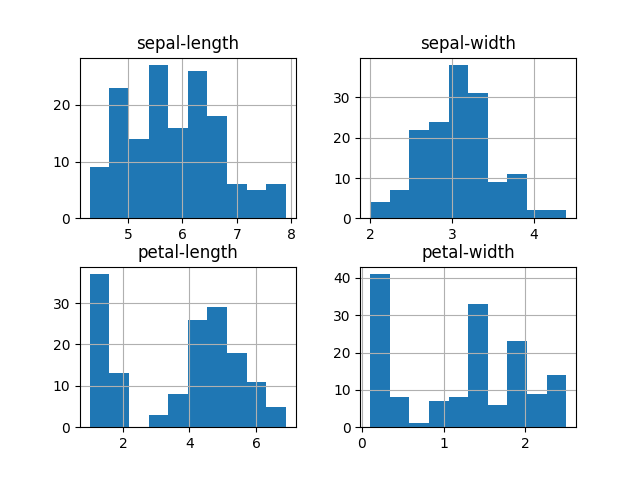

# Artificial Intelligence of Control Systems in Aircraft and Moving Vehicles

## **Andrii Popovych** СУ-402Ба Laboratory work №3

## About Laboratory Work

Thanks to laboratory work, we can get to know in detail with Decision Tree Learning.\
Classification is a two-step process, learning step and prediction step, in machine learning. In the learning step, the model is developed based on given training data. In the prediction step, the model is used to predict the response for given data. Decision Tree is one of the easiest and popular classification algorithms to understand and interpret.

### **Types of Decision Trees**

- **Categorical Variable Decision Tree**: Decision Tree which has a categorical target variable.
- **Continuous Variable Decision Tree**: Decision Tree has a continuous target variable.

### **Important Terminology related to Decision Trees**

- **Root Node**: It represents the entire population or sample and this further gets divided into two or more homogeneous sets.
- **Splitting**: It is a process of dividing a node into two or more sub-nodes.
- **Decision Node**: When a sub-node splits into further sub-nodes, then it is called the decision node.
- **Leaf / Terminal Node**: Nodes do not split is called Leaf or Terminal node.
- **Pruning**: When we remove sub-nodes of a decision node, this process is called pruning. You can say the opposite process of splitting.
- **Branch / Sub-Tree**: A subsection of the entire tree is called branch or sub-tree.
- **Parent and Child Node**: A node, which is divided into sub-nodes is called a parent node of sub-nodes whereas sub-nodes are the child of a parent node.

### **Assumptions while creating Decision Tree**

- In the beginning, the whole training set is considered as the root.
- Feature values are preferred to be categorical. If the values are continuous then they are discretized prior to building the model.
- Records are distributed recursively on the basis of attribute values.
- Order to placing attributes as root or internal node of the tree is done by using some statistical approach.

## Installing and execute

Install python3 and pip3 (if not exists)

```bash
sudo apt update
sudo apt install python3
sudo apt install python3-pip
```

Check if python3 and pip3 installed: ```python3 -V && pip3 -V```

If everything is installed correctly, you should see something similar to this:

```bash
Python 3.10.6
pip 22.0.2 from /usr/lib/python3/dist-packages/pip (python 3.10)
```

Next, you need to download the repository, install all the necessary libraries and run the script.
To do this, use the following commands:

```bash
git clone https://github.com/yope-dev/lw3.git
cd lw3
pip3 install -r requirements.txt
python3 main.py
```

## Results

Shape of the dataset: `(150, 5)`

### Dataset Figure


### Histagram Dataset



### Scatter Matrix


| Name                          | Aaccuracy, % | An array of evaluator scores for each cross-validation run. |
 :---            |    ----: |   ---: |
| Logistic Regression           | 94.16        | 0.06508541396588878                                                    |
| Linear Discriminant Analysis  | 97.5         | 0.03818813079129868                                                    |
| KNeighbors Classifier         | 95.83        | 0.04166666666666669                                                    |
| Decision Tree Classifier      | 95.0         | 0.055277079839256664                                                   |
| Gaussian Naive Bayes          | 95.0         | 0.05527707983925667                                                    |
| Support Vector Classification | 98.33        | 0.03333333333333335                                                    |

Accuracy score: `96.66666666666667%`

Confusion Matrix:

```text
[[11  0  0]
 [ 0 12  1]
 [ 0  0  6]]
```

classification_report:

|                 | precision | recall | f1-score | support |
| :---            |     ----: |   ---: |      ---:|   ---:  |
| Iris-setosa     | 1.00      | 1.00   | 1.00     | 11      |
| Iris-versicolor | 1.00      | 0.92   | 0.96     | 13      |
| Iris-virginica  | 0.86      | 1.00   | 0.92     | 6       |
| accuracy        |           |        | 0.97     | 30      |
| macro avg       | 0.95      | 0.97   | 0.96     | 30      |
| weighted avg    | 0.97      | 0.97   | 0.97     | 30      |

## Project structure

| File Name        | Description                           |
|------------------|---------------------------------------|
| main.py          | The main script of the project.       |
| requirements.txt | Required libraries and their versions.|
| iris.csv         | Dataset.                              |
| images/          | Folder for all images.                |
| Readme.md        | Project description file.             |
